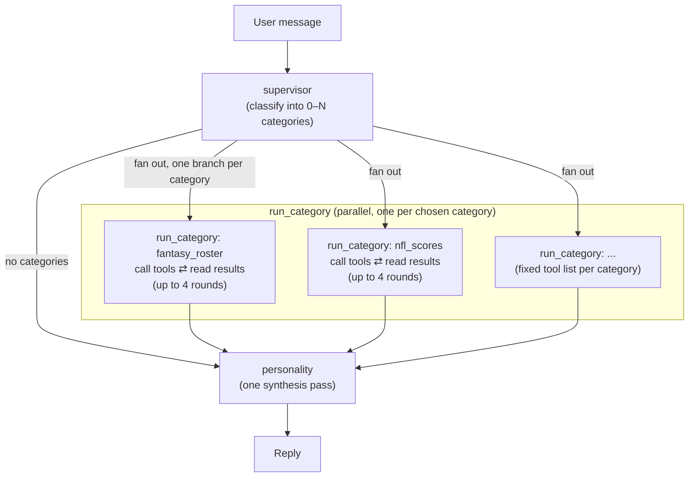

# LangGraph Workflow

`fantasy_agent/graph.py` builds a simple three-step pipeline for every
message: figure out what's being asked, go fetch the data for it (in
parallel if more than one topic applies), then write one reply. It's not a
free-form network of agents chatting with each other — each step runs
exactly once (or, for the data-fetching step, once per topic), and there's
a hard cap on how many times it can call a tool while it's fetching. That
keeps things predictable and stops the graph from ever looping forever, at
the cost of not being able to circle back for more data mid-reply if the
first read on the question missed something.



## The three node types

### 1. `supervisor` (runs once)

Reads the conversation so far and decides which **categories** of data the
latest message actually needs — zero, one, or several. `fantasy_*`
categories cover the user's private league (`fantasy_roster`,
`fantasy_standings`, `fantasy_matchup`, `fantasy_player`,
`fantasy_transaction`); `nfl_*` categories cover real-world NFL data
(`nfl_scores`, `nfl_team`, `nfl_player`, `nfl_news`, `nfl_game`). The full
list lives in `fantasy_agent/tools/__init__.py`'s `CATEGORY_REGISTRY`.

This node never calls a tool and never talks to the user directly — its
only job is picking categories. Before it picks, its prompt asks the model
to think through what data would actually answer the question (which
stats, which teams/players, what angle) rather than just pattern-matching
the topic, and to leave categories out entirely when they wouldn't help
(a greeting or a follow-up "thanks!" gets zero categories). It also knows
that fantasy team/league nicknames (e.g. "Hurts Cooks with Lamb") are
user-chosen jokes, not player names — so a question about a fantasy team
should still trigger `fantasy_roster` to look up the real roster instead of
guessing from the name.

Output is structured (`CategoryChoice`: `reasoning: str`,
`categories: List[str]`) via `with_structured_output`; any category name
the model invents that isn't in `CATEGORY_REGISTRY` is silently dropped.

### 2. `run_category` (runs 0–N times in parallel, one per chosen category)

For every category the supervisor picked, the graph spins up its own
`run_category` instance, all running at the same time (using LangGraph's
`Send`). If the supervisor picked nothing, the graph skips straight to
`personality`. Each instance can only see the tools for its own category
(`CATEGORY_REGISTRY[category]`) — so, for example, a `fantasy_roster` run
has no way to accidentally reach for an `nfl_scores` tool.

Each instance goes back and forth with the model: ask it what to do →
if it wants to call a tool, run the tool and hand back the result → ask
again → repeat, up to `MAX_TOOL_ROUNDS` (currently 4) times, then stop no
matter what. It's given the supervisor's `reasoning` as its plan, the same
nickname warning as the supervisor, and one hard rule: only call tools,
never try to summarize or answer — writing the actual reply is
`personality`'s job alone.

All categories' results land in the shared `messages` list in graph state
(LangGraph merges parallel `Send` branches' state updates automatically).

### 3. `personality` (runs once, the only node the user sees)

Takes whatever data every category gathered (already sitting in
`messages`) and writes one reply in a single model call. Two rules are baked
into its prompt and matter a lot:

- **Stay grounded**: every fact, name, or number in the reply has to come
  from this turn's tool results — never from the model's own memory or
  "usually true" background knowledge, since rosters, depth charts, and
  injury status change constantly and the model's training data isn't
  live. If the gathered data doesn't cover part of the question, it should
  say so instead of guessing.
- **Stay short**: 2–5 sentences by default, no restating the question back
  to the user, and every bare number gets a unit (`"364.9 pts"`, not
  `"(364.9)"`).

It always has to produce some reply, even for a greeting or an off-topic
message where no category ran — in that case it just answers from the
conversation itself. If the user explicitly asks for a chart or visual
comparison, it emits one fenced ` ```chart ` code block with a JSON object
instead of prose numbers (a `"comparison"` shape for several
differently-scaled metrics, a `"bar"` shape for one metric across several
things); `fantasy_agent/chart_render.py`'s `render_chart_png` turns that
JSON into the PNG served at `/api/chart`.

## Model, keys, and retry

Every node uses the same Gemini model (`FANTASY_AGENT_MODEL` env var,
default `gemini-3.5-flash`), just with different prompts/tools/settings per
node. `personality` also sets `reasoning_effort="low"`, since all it's
doing is phrasing an answer from data that's already been gathered — it
doesn't need to reason further. Without that cap, vague or off-topic turns
have been seen to burn their whole output budget on internal reasoning and
come back with no actual reply text.

`invoke_with_fallback()` wraps every model call: try `GOOGLE_API_KEY`
first, and if it fails in a way a second key could plausibly fix (HTTP
429, or an error mentioning "quota"/"credit balance"), retry once against
`GOOGLE_API_KEY_BACKUP` if one's configured. Anything else just fails.

`personality` has one more fallback on top of that: if the model call comes
back with no text at all, it falls back to a fixed "Sorry, I didn't quite
catch that" instead of showing the user an empty message.

## State shape

`AgentState` (a `MessagesState` subclass) carries `messages` — the running
conversation, shared across every node — plus `categories` and `reasoning`,
which the supervisor sets and `run_category` reads, and a `category` field
naming which category a given parallel branch belongs to.

## Tracing

Every node calls `fantasy_agent/trace.py`'s `emit()` around its work
(`node_start`/`node_end` pairs, plus `tool_call`/`tool_result` inside
`run_category`) rather than printing directly. `emit()` just prints
(`[trace] <event> <data>`) — it's a local log line, nothing consumes these
over the network. `scripts/chat_audit.py` is the one place that reads them
back, by temporarily monkeypatching `trace.emit` to also capture events
into its report.

## Adding a new data source

Add a `@tool`-decorated function to the right module under
`fantasy_agent/tools/` (or a new module, registered in
`fantasy_agent/tools/__init__.py`'s `_MODULES` dict, if it's a whole new
category). The supervisor and graph pick it up automatically from
`CATEGORY_REGISTRY`/`CATEGORY_DESCRIPTIONS` — `graph.py` itself doesn't
need to change. See [`NFL_PUBLIC_API.md`](./NFL_PUBLIC_API.md) and
[`FANTASY_ESPN_API.md`](./FANTASY_ESPN_API.md) for what each existing tool
calls.
