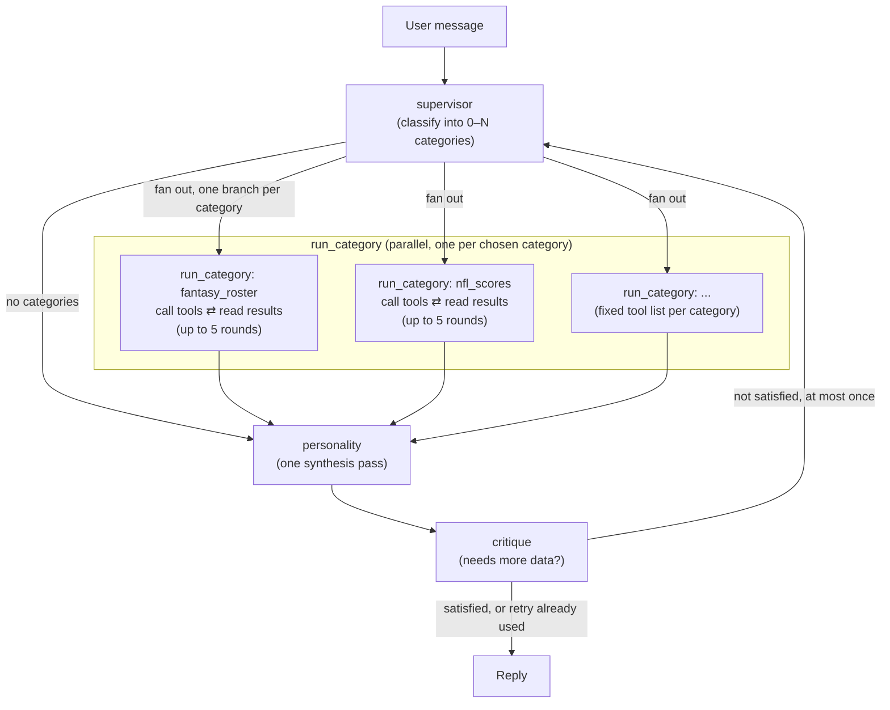

# LangGraph Workflow

`fantasy_agent/graphs/graph.py` builds a bounded pipeline for every
message: figure out what's being asked, go fetch the data for it (in
parallel if more than one topic applies), write one reply, then have a
critic check it. It's not a free-form network of agents chatting with each
other — each step runs once (the data-fetching step once per topic), tool
calls are hard-capped, and the critic can send the graph back to the
supervisor at most once. That keeps things predictable and stops the graph
from ever looping forever.



## The four node types

### 1. `supervisor` (runs once)

Reads the conversation so far and decides which **categories** of data the
latest message actually needs — zero, one, or several. `fantasy_*`
categories cover the user's private league (`fantasy_roster`,
`fantasy_standings`, `fantasy_matchup`, `fantasy_player`,
`fantasy_transaction`); `nfl_*` categories cover real-world NFL data
(`nfl_scores`, `nfl_team`, `nfl_player`, `nfl_news`, `nfl_game`). The full
list lives in `fantasy_agent/tools/__init__.py`'s `CATEGORY_REGISTRY`.

This node never calls a tool and never talks to the user directly — its
only job is picking categories. Before it picks, its prompt asks the model
to think through what data would actually answer the question (which
stats, which teams/players, what angle) rather than just pattern-matching
the topic, and to leave categories out entirely when they wouldn't help
(a greeting or a follow-up "thanks!" gets zero categories). It also knows
that fantasy team/league nicknames (e.g. "Hurts Cooks with Lamb") are
user-chosen jokes, not player names — so a question about a fantasy team
should still trigger `fantasy_roster` to look up the real roster instead of
guessing from the name.

Output is structured (`CategoryChoice`: `reasoning: str`,
`categories: List[str]`) via `with_structured_output`; any category name
the model invents that isn't in `CATEGORY_REGISTRY` is silently dropped.

### 2. `run_category` (runs 0–N times in parallel, one per chosen category)

For every category the supervisor picked, the graph spins up its own
`run_category` instance, all running at the same time (using LangGraph's
`Send`). If the supervisor picked nothing, the graph skips straight to
`personality`. Each instance is labeled with its own category, but every tool from every
category is bound to it (`_ALL_TOOLS`), so the split parallelizes the work
rather than restricting which tools a run can reach for.

Each instance goes back and forth with the model: ask it what to do →
if it wants to call a tool, run the tool and hand back the result → ask
again → repeat, up to `MAX_TOOL_ROUNDS` (currently 5) times, then stop no
matter what. It's given the supervisor's `reasoning` as its plan, the same
nickname warning as the supervisor, and one hard rule: only call tools,
never try to summarize or answer — writing the actual reply is
`personality`'s job alone.

All categories' results land in the shared `messages` list in graph state
(LangGraph merges parallel `Send` branches' state updates automatically).

### 3. `personality` (runs once, the only node the user sees)

Takes whatever data every category gathered (already sitting in
`messages`) and writes one reply in a single model call. Two rules are baked
into its prompt and matter a lot:

- **Stay grounded**: every fact, name, or number in the reply has to come
  from this turn's tool results — never from the model's own memory or
  "usually true" background knowledge, since rosters, depth charts, and
  injury status change constantly and the model's training data isn't
  live. If the gathered data doesn't cover part of the question, it should
  say so instead of guessing.
- **Stay short**: 1–6 sentences by default (longer only if needed), no restating the question back
  to the user, and every bare number gets a unit (`"364.9 pts"`, not
  `"(364.9)"`).

It always has to produce some reply, even for a greeting or an off-topic
message where no category ran — in that case it just answers from the
conversation itself. If the user explicitly asks for a chart or visual
comparison, it emits one fenced ` ```chart ` code block with a JSON object
instead of prose numbers (a `"comparison"` shape for several
differently-scaled metrics, a `"bar"` shape for one metric across several
things); `fantasy_agent/utils/chart_render.py`'s `render_chart_png` turns that
JSON into the PNG served at `/api/chart`.

### 4. `critique` (runs once after each `personality`)

A strict-reviewer model call (structured output `Critique`: `satisfied`,
`missing`) that checks whether the reply fully answers the question using
only the gathered data. It flags a reply only if pulling more data would
meaningfully improve it — never for style, tone, or length. If unsatisfied,
`missing` becomes the new plan and the graph loops back to `supervisor`;
`route_after_critique` ends the run once `critique_rounds` exceeds
`MAX_CRITIQUE_ROUNDS` (1), so there is at most one retry. The retry appends
to the same `messages`, so `personality` answers again from the accumulated
transcript.

## Model, keys, and retry

Every node uses the same Gemini model (`FANTASY_AGENT_MODEL` env var,
default `gemini-3.7-flash`), just with different prompts/tools/settings per
node. Reasoning effort is `high` for `supervisor` and `personality` and `medium`
for `run_category` and `critique`. High effort on `personality` once caused
empty replies on off-topic turns, so re-verify that after prompt changes.

`invoke_llm()` wraps every model call with `GOOGLE_API_KEY`.

`personality` has one fallback of its own: if the model call comes back
with no text at all, it falls back to a fixed "Sorry, I didn't quite
catch that" instead of showing the user an empty message.

## State shape

`AgentState` (a `MessagesState` subclass) carries `messages` — the running
conversation, shared across every node — plus `categories` and `reasoning`,
which the supervisor sets and `run_category` reads, a `category` field
naming which category a given parallel branch belongs to, and
`critique_rounds` / `critique_satisfied`, which `critique` sets to drive the
retry routing.

## Tracing

Every node calls `fantasy_agent/logging/trace.py`'s `emit()` around its work
(`node_start`/`node_end` pairs, plus `tool_call`/`tool_result` inside
`run_category`) rather than printing directly. `emit()` just prints
(`[trace] <event> <data>`) — it's a local log line, nothing consumes these
over the network. `tests/chat_audit.py` is the one place that reads them
back, by temporarily monkeypatching `trace.emit` to also capture events
into its report.

## Adding a new data source

Add a `@tool`-decorated function to the right module under
`fantasy_agent/tools/` (or a new module, registered in
`fantasy_agent/tools/__init__.py`'s `_MODULES` dict, if it's a whole new
category). The supervisor and graph pick it up automatically from
`CATEGORY_REGISTRY`/`CATEGORY_DESCRIPTIONS` — `graph.py` itself doesn't
need to change. See [`NFL_PUBLIC_API.md`](./NFL_PUBLIC_API.md) and
[`FANTASY_ESPN_API.md`](./FANTASY_ESPN_API.md) for what each existing tool
calls.
